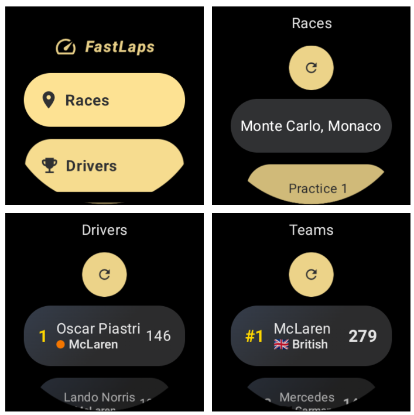

# 🏁 Fast Laps - Wear OS App for F1 Fans

**Fast Laps** is a Wear OS application that allows users to view live race positions and stay updated with the current drivers' and constructors' championship standings in Formula 1.

This app is built with **Kotlin** and designed specifically for **Wear OS smartwatches**, offering a fast, lightweight experience focused on delivering key race data at a glance.

---

## 📲 Features

- 🏎️ Live race positions during Formula 1 events.
- 🏆 Drivers' Championship standings.
- 🏢 Constructors' Championship standings.
- ⚙️ Optimized for Wear OS devices.

---
## 🌐 Data Sources

Fast Laps uses the following public APIs to fetch race and championship data:

- [**Ergast API**](http://ergast.com/mrd/) – Historical and current F1 data (standings, results, etc.)
- [**OpenF1 API**](https://openf1.org/) – Real-time data feeds for race positions and telemetry

---

## 🚀 Try the App

To install and test **Fast Laps**, follow these steps:

1. Join the tester group:  
   👉 [Testers Community - Google Groups](https://groups.google.com/g/testers-community/about?pli=1)

2. Access the beta testing link:  
   👉 [Beta Access](https://play.google.com/apps/testing/com.leandro.fastlaps)

3. Install the app from the Play Store:  
   👉 [Play Store Listing](https://play.google.com/store/apps/details?id=com.leandro.fastlaps&pli=1)

---

## 🤝 Contributing

Pull Requests are welcome! If you’d like to help improve the app, fix bugs, or add new features, feel free to open a **PR**.

### ✨ Some contribution ideas:

- UI/UX improvements for Wear OS.
- Support for different screen sizes.
- Battery usage optimizations.
- New features (e.g., race reminders, advanced stats, notifications, etc.).

---

## 🛠️ Tech Stack

- **Language:** Kotlin  
- **Platform:** Android Wear OS  
- **IDE:** Android Studio  

---

## 🏆 Preview

---
## 📧 Contact

Feel free to open an issue or reach out if you have any questions, suggestions, or feedback.

---

Thanks for supporting the development of Fast Laps! 🏎️💨
