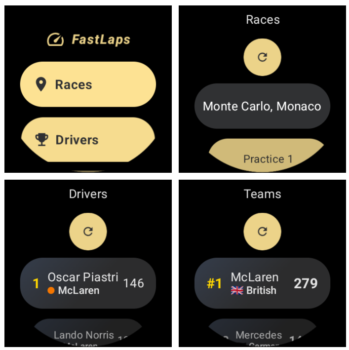

# Fast Laps - F1 App for Wear OS

**Fast Laps** is a Formula 1 application for **Wear OS smartwatches**, offering a fast, lightweight experience focused on delivering key race data at a glance.

---

## Features

- Race results (Race, Qualifying, Sprint)
- Full season calendar with local times
- Drivers' Championship standings
- Constructors' Championship standings
- F1 News from Motorsport.com (EN/ES)
- Wear OS Tiles (Next Race countdown, Driver Standings)
- Watch face Complications (Next Race, Championship leader)
- Session notifications (15 min before and at start)
- Rotary bezel scroll support
- Multi-language support (English/Spanish)
- In-memory caching for offline resilience

---

## Data Sources

Fast Laps uses the following public APIs:

- [**Jolpica F1 API**](https://api.jolpi.ca/ergast/) - Race schedule, results, driver & constructor standings (Ergast-compatible)
- [**Motorsport.com RSS**](https://www.motorsport.com/rss/f1/news/) - F1 news feeds (English & Spanish)

---

## Try the App

1. Join the tester group:
   [Testers Community - Google Groups](https://groups.google.com/g/testers-community/about?pli=1)

2. Access the beta testing link:
   [Beta Access](https://play.google.com/apps/testing/com.leandro.fastlaps)

3. Install the app from the Play Store:
   [Play Store Listing](https://play.google.com/store/apps/details?id=com.leandro.fastlaps&pli=1)

---

## Tech Stack

- **Language:** Kotlin 2.0 with Jetpack Compose
- **Platform:** Android Wear OS (Min SDK 30)
- **Architecture:** MVVM with Repository pattern
- **UI:** Wear Compose (ScalingLazyColumn, Chip, Card)
- **Networking:** Retrofit 2.9 + OkHttp + Gson + Coroutines
- **Tiles:** ProtoLayout Material
- **Complications:** Watchface Complications API
- **Notifications:** WorkManager (periodic session alerts)
- **Navigation:** Compose Navigation

---

## Development

```bash
./gradlew assembleDebug          # Build debug APK
./gradlew assembleRelease        # Build release APK
./gradlew bundleRelease          # Create release AAB for Play Store
./gradlew installDebug           # Install on connected device
./gradlew clean                  # Clean build artifacts
```

---

## Contributing

Pull Requests are welcome! Some ideas:

- UI/UX improvements for different watch sizes
- Battery usage optimizations
- Additional languages
- Live session data integration

---

## Preview



---

## Contact

Feel free to open an issue or reach out if you have any questions, suggestions, or feedback.

---

Thanks for supporting the development of Fast Laps!
